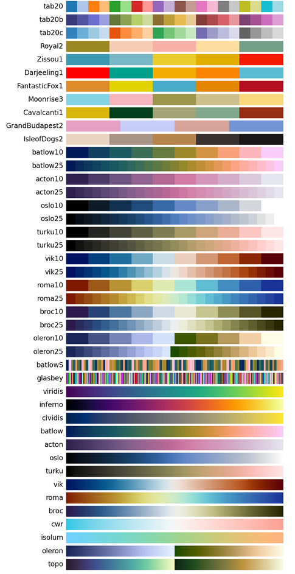

# Introduction

This python package contains a collection of nice color maps for scientific visualizations and provides a convinient and unified way to pick the color maps.

Some color maps are perceptually uniform and/or color blind friendly.

# Guideline for choosing color maps

