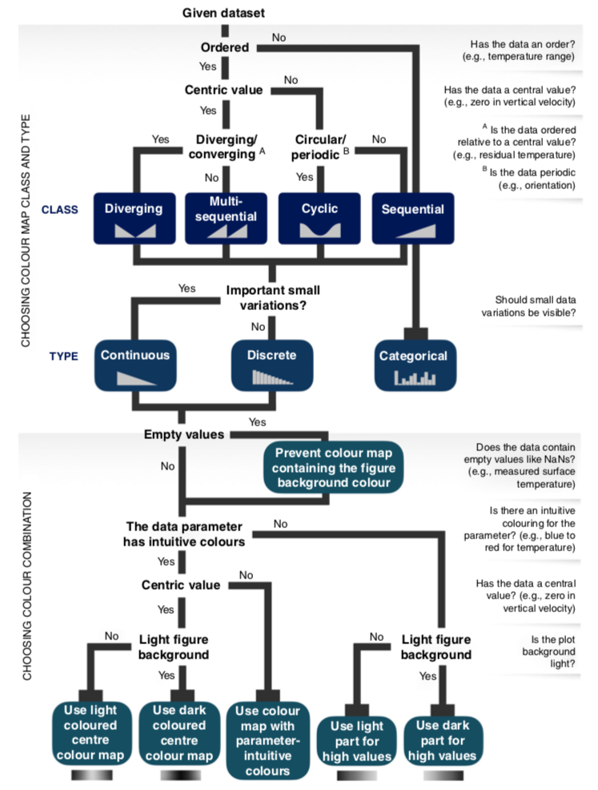

# Introduction

[](https://badge.fury.io/py/scicolor)

This python package contains a collection of nice color maps for scientific visualizations and provides a convinient and unified way to pick the color maps. Some color maps are perceptually uniform and/or color blind friendly.

# Quick start

### Install

The package is available through pypi.
You can install it using the following command:

```sh
pip install scicolor
```

### Import the package

```python
import scicolor
```

### Get a color map

```py
scicolor.get_cmap('viridis')
```

`scicolor.get_cmap()` works just like `plt.get_cmap()`.
The returned value can be instances of either `matplotlib.colors.ListedColormap` or `matplotlib.colors.LinearSegmentedColormap`.

You can access the colors of `matplotlib.colors.ListedColormap` instances by `.colors`.

### List available color maps

List all color maps

```py
scicolor.list_cmaps()
```

List the color maps that are sequential, discrete, and color blind friendly

```py
scicolor.list_cmaps(cm_class='sequential', cm_type="discrete", color_blind_friendly=True)
```

See below for more on the classes and types of the color maps.

### Plot color maps

Plot a color map

```py
scicolor.plot_cmaps('tab20')
```

Plot multiple color maps

```py
scicolor.plot_cmaps(['tab20', 'tab20b'])
```

Plot the color maps that are sequential, discrete, and color blind friendly

```py
scicolor.plot_cmaps(cm_class='sequential', cm_type="discrete", color_blind_friendly=True)
```

Below is a screen shot of `scicolor.plot_cmaps()`, which shows all available color maps.


# Characteristics of the color maps

See the following table for different characteristics of the color maps.
You can use the corresponding paramters in `scicolor.list_cmaps()` and `scicolor.plot_cmaps()` to filter the results.

| Characteristic       | Parameter              | Values                                                               |
| -------------------- | ---------------------- | -------------------------------------------------------------------- |
| class                | `cm_class`             | 'categorical', 'diverging', 'misc', 'multi_sequential', 'sequential' |
| type                 | `cm_type`              | 'categorical', 'continuous', 'discrete'                              |
| perceptually uniform | `perceptually_uniform` | True, None                                                           |
| color blind friendly | `color_blind_friendly` | True, None                                                           |

See the guideline below for more on the class and type.

# Guideline for choosing color maps

Figure below contains the guideline for choosing color maps.



The figure was borrowed from [The misuse of colour in science communication](https://doi.org/10.1038/s41467-020-19160-7).

# Color maps sources

The color maps come from different sources, see the table below for details

| Source                 | Color maps                                                                                                                                                                                             | Link                                                         |
| ---------------------- | ------------------------------------------------------------------------------------------------------------------------------------------------------------------------------------------------------ | ------------------------------------------------------------ |
| matplotlib             | tab20, tab20b, tab20c, viridis, inferno, cividis                                                                                                                                                       | https://matplotlib.org/3.1.0/tutorials/colors/colormaps.html |
| Scientific colour maps | batlow10, batlow25, acton10, acton25, oslo10, oslo25, turku10, turku25, vik10, vik25, roma10, roma25, broc10, broc25, oleron10, oleron25, batlowS, batlow, acton, oslo, turku, vik, roma, broc, oleron | http://www.fabiocrameri.ch/colourmaps.php                    |
| Wes Anderson           | Royal2, Zissou1, Darjeeling1, FantasticFox1, Moonrise3, Cavalcanti1, GrandBudapest2, IsleofDogs2                                                                                                       | https://github.com/karthik/wesanderson                       |
| CET                    | glasbey, cwr, isolum                                                                                                                                                                                   | https://peterkovesi.com/projects/colourmaps/                 |
| ocean                  | topo                                                                                                                                                                                                   | https://matplotlib.org/cmocean/                              |
| Met Brewer             | Archambault, Cassatt1, Cassatt2, Demuth, Derain, Egypt, Greek, Hiroshige, Hokusai2, Ingres, Isfahan1, Isfahan2, Java, Johnson, Kandinsky, Morgenstern, OKeeffe1, OKeeffe2, Pillement, Tam, Troy, Veronese  | https://github.com/BlakeRMills/MetBrewer                     |


## Matplotlib

The present package simply offers a wrapper for the selected color maps that are included in matplotlib.
To add more matplotlib color maps to `scicolor`, just add the information to `color_info_list` in `__init__.py`.

## Scientific colors

[Scientific colour maps](http://www.fabiocrameri.ch/colourmaps.php) provides a series of perceptually uniform and color blind friendly color maps.
To expand the list included in `scicolor`:

1. Download the data from [zenodo](doi.org/10.5281/zenodo.1243862)
2. Copy the `.txt` files to `/path/to/scicolor/scicolor/scientific_colors`
3. Add the information to `color_info_list` in `__init__.py`

## Wes Anderson

[Wes Anderson Palettes](https://github.com/karthik/wesanderson) provides a series of categorical colors extract from Wes Anderson movies.
Note that the color maps might not be color blind friendly, use with cautions.
To expand the list:

1. Copy the [color data](https://github.com/karthik/wesanderson/blob/master/R/colors.R) to `__init__.py`
2. Add the information to `color_info_list` in `__init__.py`

## CET

[CET (Centre for Exploration Targeting)](https://peterkovesi.com/projects/colourmaps/) offers many perceptually uniform color maps.
To expand the list

1. Download the color data from [github](https://github.com/holoviz/colorcet/tree/master/assets) to `/path/to/scicolor/scicolor/cet_colors`
2. Assgin meaniful names to the color data files. References can be found in their [script](https://github.com/holoviz/colorcet/blob/master/assets/CET_to_py.py)
3. Add the information to `color_info_list` in `__init__.py`

## ocean

[CMOcean (colormaps inspired by oceanography)](https://matplotlib.org/cmocean/) provides a series of perceptually uniform color maps.
To expand the list

1. Download the color data from [github](https://github.com/matplotlib/cmocean/tree/master/cmocean/rgb) to `/path/to/scicolor/scicolor/ocean_colors`
2. Add the information to `color_info_list` in `__init__.py`

## MetBrewer

[MetBrewer](https://github.com/BlakeRMills/MetBrewer) provides a series of palettes inspired by works at the Metropolitan Museum of Art in New York.
Currently the `scicolor` package only includes the color-blind-friendly colors from MetBrewer.

## Requirements

- python3
- matplotlib
- pandas
- numpy
